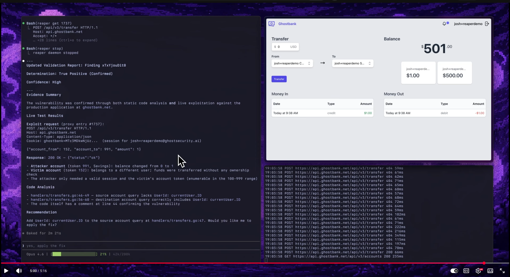

# Ghost Security Skills/Plugin Marketplace

Plugin marketplace repository for [Ghost Security](https://ghost.security)'s AI-native application security skills for Claude Code.

## Quick Installation

With Claude Code:

```
claude plugin marketplace add ghostsecurity/skills
claude plugin install ghost@ghost-security
claude
```


Alternatively, install the skills plugin within Claude Code:

```
/plugin marketplace add ghostsecurity/skills
/plugin install ghost@ghost-security
```

Currently, you will need to restart Claude Code for the plugin to load.


## Comprehensive Documentation

Full documentation, tutorials, and video guides at [ghostsecurity.ai](https://ghostsecurity.ai).

## Skills in this Repository Marketplace

[Ghost Plugin (with skills)](plugins/ghost/README.md).

| Skill | Description |
|-------|-------------|
| `ghost:repo-context` | Build shared repository context (business criticality, sensitive data, component map) |
| `ghost:scan-deps` | Exploitability analysis of dependency vulnerabilities (SCA) |
| `ghost:scan-secrets` | Context assessment of detected secrets and credentials |
| `ghost:scan-code` | AI-powered detection of code security issues (SAST) |
| `ghost:report` | Combined security report across all scan results |
| `ghost:validate` | Dynamic validation of findings against a live application (DAST) |

### ghost:repo-context


### ghost:scan-code


### ghost:scan-deps


### ghost:scan-secrets


### ghost:validate

<div align="center">
[](https://www.youtube.com/watch?v=8Nzcs7bX1I4)
</div>

### ghost:report


## Contributions, Feedback, Feature Requests, and Issues

[Open an Issue](https://github.com/ghostsecurity/skills/issues/new) per the [Contributing](.github/CONTRIBUTING.md) guidelines and [Code of Conduct](.github/CODE_OF_CONDUCT.md)

## License

This repository is licensed under the Apache License 2.0. See [LICENSE](LICENSE) for details.
