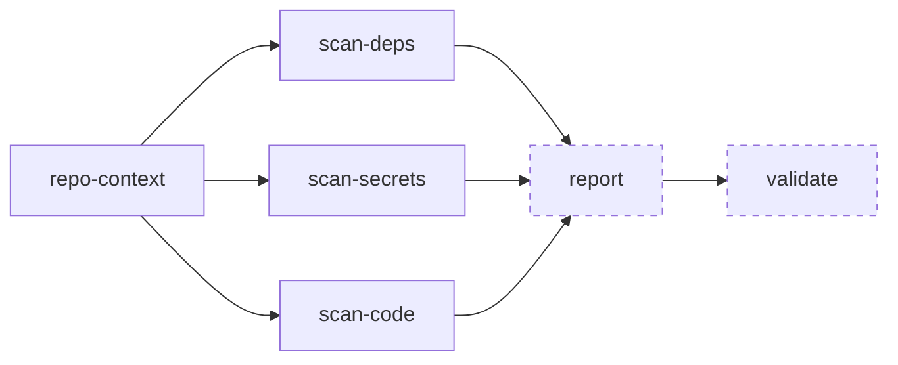

# The scan lifecycle

A full Ghost Security AppSec Skills scan follows a structured pipeline: build context, run the scans, aggregate findings, optionally validate, fix, and/or generate a report.

## The pipeline



Each stage produces artifacts that flow into the next. Everything is stored locally at `~/.ghost/repos/<repo_id>/`. See [Caching and incremental runs](#caching-and-incremental-runs) for what later runs reuse.

## Stage 1: Repository context

**Skill:** `ghost-repo-context`

[](https://www.youtube.com/watch?v=lGUputgTQyg)

Before scanning anything, Ghost Security AppSec Skills build a shared understanding of your codebase. This context informs every scan that follows.

The context-building process works in two passes:

1. **Detection** -- discovers all distinct technology stacks in the repository (backend, frontend, mobile, CLI, library, infrastructure-as-code). Maps the directory structure and identifies dependency files.
2. **Summarization** -- for each detected project, samples key directories and files to assess business criticality, identify sensitive data types (PII, payment, authentication, health, financial), and write an architectural summary.

<div align="center"></div>

The output is a `repo.md` file cached at `~/.ghost/repos/<repo_id>/cache/repo.md`. This file is read by every subsequent skill to make informed decisions about what to scan and how to prioritize findings.

## Stage 2: Scans

Three scans each focus on a different class of vulnerability. Each scan skill runs on its own invocation.

### Dependency scanning

`ghost-scan-deps`

[](https://www.youtube.com/watch?v=PDofmYRUtOc&t=43s)

1. **Discover** -- finds all lockfiles in the repository (go.mod, package-lock.json, Gemfile.lock, Cargo.lock, etc.)
2. **Scan** -- runs [Wraith](../tools/wraith.md) against each lockfile, querying the OSV database for known CVEs
3. **Analyze** -- for each vulnerability found, AI analyzes exploitability: Is the vulnerable function actually called? Can user input reach it? Is this production code or a test dependency?
4. **Summarize** -- generates a report with coverage statistics and confirmed findings

### Secret scanning

`ghost-scan-secrets`

[](https://www.youtube.com/watch?v=iLarJzJrnnA&t=42s)

1. **Scan** -- runs [Poltergeist](../tools/poltergeist.md) against the codebase using 163 built-in rules
2. **Analyze** -- for each match, AI assesses context: Is this a real secret or a placeholder? Is it hardcoded or loaded from an environment variable? Is it in production code or test fixtures?
3. **Summarize** -- generates a report separating confirmed risks from false positives

### Code analysis

`ghost-scan-code`

[](https://www.youtube.com/watch?v=1ACDX67xb-k&t=67s)

1. **Plan** -- reads the repository context and selects vulnerability vectors to check based on the project type and depth setting (quick: top 3, balanced: top 5, full: top 10 vectors). Projects of type `iac` and `cli` get zero scans.
2. **Nominate** -- fast-triages files using pattern matching to identify candidates for each vulnerability vector
3. **Analyze** -- deep analysis of nominated files: traces data flows from user input to dangerous sinks, checks for mitigations, validates against structured criteria
4. **Verify** -- independent verification of each finding by a separate analysis pass that checks for missed mitigations and confirms all criteria are met

Each scan writes its findings as individual Markdown files to `~/.ghost/repos/<repo_id>/scans/<commit_sha>/<scan_type>/findings/`.

## Stage 3: Report

**Skill:** `ghost-report`

[](https://www.youtube.com/watch?v=LsOc2tiAY6E&t=81s)

The report skill aggregates findings from all completed scans into a single prioritized document.

It reads every finding file, filters by confidence (excluding rejected and false-positive findings), and sorts by severity. The output is a `report.md` that inlines the full content of each finding: the actual vulnerability details, code snippets, and remediation guidance.

The report includes:

- **Executive summary** -- overall security posture with business context
- **Critical and high findings** -- full details inlined for each finding
- **Medium findings** -- full subsections, not condensed
- **Scan coverage** -- statistics per scan type (candidates found, confirmed, false positives)
- **Methodology** -- notes on what each scan covered and how

Low-severity findings are omitted from the combined report but remain available in the per-scan output directories.

## Stage 4: Validation

**Skill:** `ghost-validate`

[](https://www.youtube.com/watch?v=8Nzcs7bX1I4)

For findings that need proof, the validate skill performs deeper investigation:

1. **Code analysis** -- reads the vulnerable file, traces the request flow from route registration through middleware to handler, and verifies the specific claim (e.g., "authorization check is missing")
2. **Live testing** (when available) -- starts a Reaper proxy scoped to the application's domain, captures traffic to the vulnerable endpoint, and attempts to demonstrate the exploit

The result is a determination: **true positive**, **true positive (confirmed with live test)**, **false positive**, or **inconclusive**, along with detailed evidence.

Validation is per-finding and interactive. You choose which findings to validate based on the report.

## Caching and incremental runs

Ghost Security AppSec Skills cache at two levels:

- **Repository context** (`~/.ghost/repos/<repo_id>/cache/`) -- shared across all scans. `ghost-repo-context` reuses an existing `repo.md`. Delete it to rebuild the context.
- **Scan results** (`~/.ghost/repos/<repo_id>/scans/<commit_sha>/`) -- per-commit, so each commit gets its own scan directory

Your first scan builds context and runs all analyzers. On the same commit, `ghost-report` returns the existing `report.md` and `ghost-scan-code` reuses its saved scan plan. `ghost-scan-deps` and `ghost-scan-secrets` run every step on each invocation. When you push new code, the new commit gets a fresh scan.

## Running individual stages

You don't have to run the full pipeline. Each skill works independently:

```shell
# Just scan secrets
claude "/ghost-scan-secrets"

# Just scan dependencies
claude "/ghost-scan-deps"

# Just run code analysis at full depth
claude "/ghost-scan-code depth=full"

# Generate a report from existing scan results
claude "/ghost-report"

# Validate a specific finding
claude "/ghost-validate path/to/finding.md"
```

`ghost-scan-code` uses the repository context to plan which vulnerability vectors to check. It runs `ghost-repo-context` first when `repo.md` is missing. The other scans work without it but do benefit from its context if present.

---

Previous: [Tools and skills](tools-and-skills.md) | Next: [Secret scanning](../capabilities/secret-scanning.md) | [Docs home](../../README.md#documentation)
